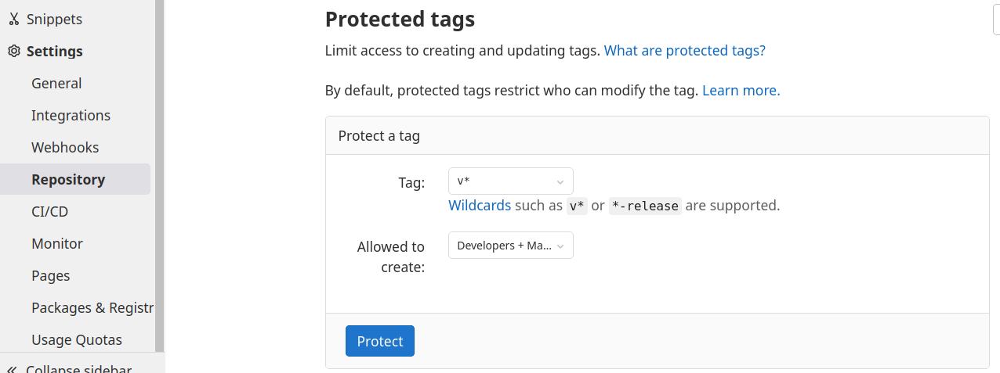
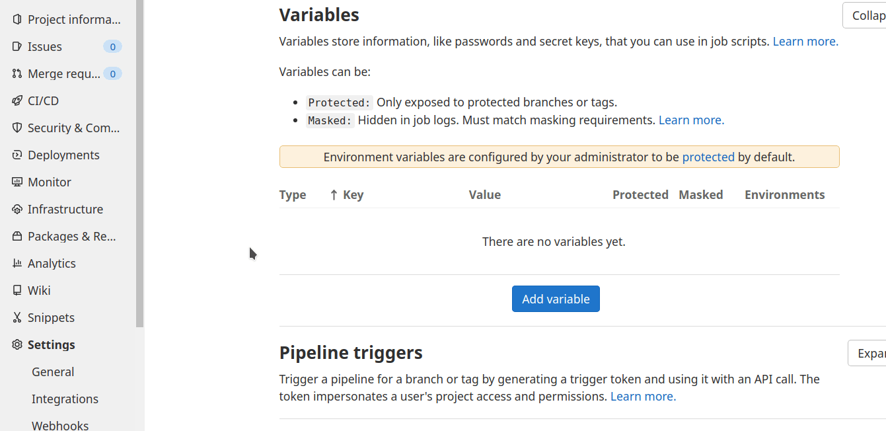
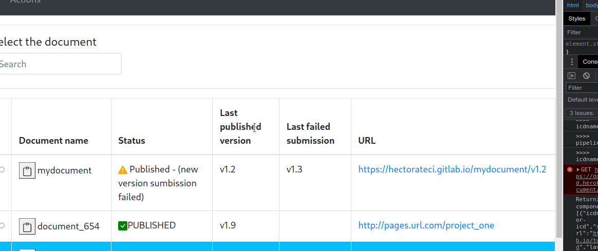
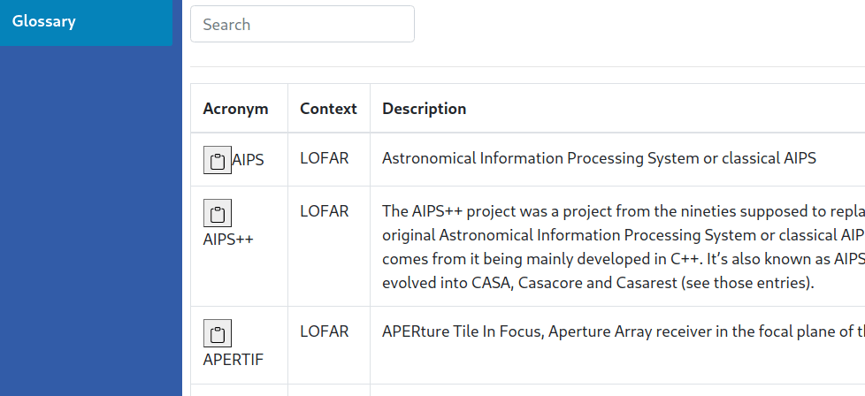
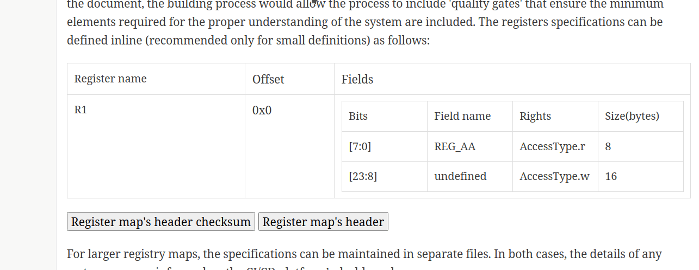
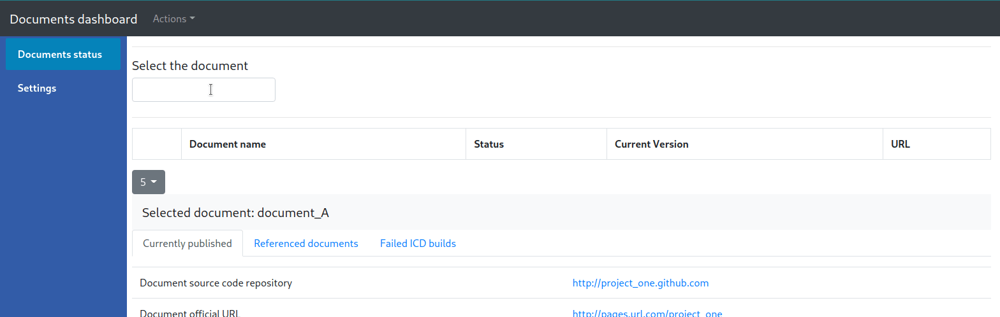

# Document-as-code in the context of Interface-Control documents

A number of empirical studies suggest that serious integration and operational problems in large-scale systems/systems-of-systems are often linked to Interface Control Documents (ICDs) management. These empirical studies suggest that interfaces are in many cases incomplete or unclearly defined, especially between hardware and software subsystems, that, together with the domain knowledge gap between the owners and the users of the interface, often lead to misunderstandings or potentially false assumptions. Furthermore, the development of the software artifacts derived from them (e.g., simulations, tests) are error-prone because the ICDs, by being human-readable-only, require manual transcription. This also creates a problem of redundant specifications scattered across multiple artifacts ---both the human-readable document and the artifacts derived from them--- and hence the risk of having them out-of-sync with each other. 

With this motivation, an action research study is being carried on in the context of LOFAR, with the goal of identifying and evaulating alternative ICD management approaches that could improve the aforementioned issues.

In the particular case of LOFAR, the ICDs have been managed in word-processing documents under version control, having recently switched to a corporate-based wikis for this purpose. Given this context, during the diagnosing phase of the action research study, the following details on the aforementioned issues were identified:


## Interface documentation-related issues

- The ICDs often contains terminology that was clear for the people involved in its original version, but years later it could be interpreted differently. This problem is exacerbated by the fact that hardware and software engineers use similar terminology with different interpretations from each one’s domain.
- Some trivial, but critical elements are often omitted on the ICDs. This could lead to risky assumptions, or to error-prone informal information exchange to fill the details gap.
- Badly written definitions due to the lack of English proficiency of the writers, or misinterpretation of existing definitions due to the same language-proficiency issues.
- Time-behavioral and state-related aspects of the interfaces are often not included in the ICDs. 

## Interface documentation management-related issues

- Changes on the ICDs are not announced but rather discovered by people working with them.
- There is a need for the right balance of documentation maintenance efforts and the actual engineering/development ones. Currently, information is duplicated across ICDs, the implemented artifacts, and other tools created to support the development process.

## Study design

In the action planning phase of the first cycle of the study, a documentation management approach inspired on the document-as-code philosophy, i.e., managing documentation the same way software source code is managed in modern settings, has been proposed. This first cycle is particularly aimed at exploring the first two of the aforementioned documentation-related issues, and the documentation-managament ones. The remaining ones ---language-proficiency related, and the lack of dynamic behavior details--- will be explored in the following cycle based on the findings of this evaulation exercise. Given the above, this documentation management approach includes the following elements:


1. In order to make the technical documentation (in this case, ICDs) compatible with modern software-centered versioning control systems and automation platforms, a machine-readable, text-based markup language for the writing process.

2. A Continuous-Integration/Continuous-Delivery pipeline, commonly used in a software setting to automate the building and quality assessment of source code, is tailored to the context of technical documentation. With this, the organization can define policies for documentation quality enforcement before an ICD is published.

3. The integration of one or more formalisms for the specification of technical elements wihtin the ICDs (e.g., hardware descriptions) is allowed. With this, and a number of automatic transformations applied to them for content or software artifacts generation, the ICDs are expected to become the single-source-of truth during subsystem interface development or maintenance.

4. A centralized management of the documents created under this document-as-code environment is put into place, so the documents and the dependencies between their different versions (e.g., when an ICD refers to a particular version of the previous one) can be tracked. With this, the people whose work depend on these documents can be aware (or notified about) when an update is taking place.

In the following exercise, you will perform a test-drive, in a set of scenarios, of a working prototype of the documentation pipeline described above. 


### Scenario one - Document versioning and basic ICDs publication/tracking

In the proposed documentation management approach, each ICD is written in a markup language and maintained on its own Git repository. In this exercise, you will test-drive two artifacts: (1) a docker container that build and test (against the predefined 'quality gates') these documents within a CI/CD pipeline, and (2) a document-centered platform that keep track of the status of the overall documentation.

Steps:

1. Create a new public, empty repository on Gitlab (https://www.gitlab.com), as the tools have not been tested on private Gitlab configurations. Choose a name that you think would be meaninful for a technical document.

2. Use the [following document](index.adoc) as a template for your first (and rather small) ICD. Make sure you the file is in the root of the repository, and that it keeps the 'index.adoc' name. Add this document to your repository. Add some content or diagramas.

3. To integrate your repository into the centralized documentation pipeline, first enable the "Protected Tags" to the ones with the pattern v* (allowing developers and maintainers to create them). Then set the variable BACKEND_CREDENTIALS (with the values sent to you by email), with the flags 'Protect variable' and 'Mask variable' enabled.





4. Create a .gitlab-ci.yml (with the '.' at the beginning) at the root of your local repository if it doesnt exist yet. Set the following YAML code as its (only) content:

```yml
include:
  - remote: https://gitlab.com/hcadavid/dac-pipeline-configuration/-/raw/main/cicdconfig.yml
```

5. Once you commit and push the above changes, a CI/CD job should be launched. The compiled document should be now accessible in gitlab pages at <your_user_name>.gitlab.io/<repo_name>/stage. This 'staging' version of the document, which won't be considered as an official one, would be useful for reviews before posting an actual version of the document.

6. Now, add more content to what will be the first official version of the document. In order publish the document as such, commit the changes and create an annotated tag. Given that the messages on the annotated tags would be used for automatically generate the __Document history__ section of the document, write one that would work for this purpose, e.g.:

```
$ git tag -a v0.1 -m "Draft version ... "
```

7. Push the tag to the gitlab repository. This time, as you are pushing a concrete version of the document, the building and validation process will exchange information with the document management system to start keep tracking of this and future versions. Once the document has been built and published, its information should be now available on the [documentation management dashboard](https://documentation-dashboard.herokuapp.com/). Use the same user/name credentials sent to your email for authentication. Open the last official version of the document by following the provided link in the documents list.



8. Create a second repository for a different ICD (you will make references between them in one of the following scenarios) and publish a version of it. You can just duplicate the previous one and change part of the content, just do not forget to add the BACKEND_CREDENTIALS variable and enable the protected tags.

9. If you are able to check the details of both documents, and their status is PUBLISHED, you are done with the basic publication scenario. Otherwise, please double check the previous steps or get in touch with the researchers for assistance). 


### Scenario two - Quality gates

The concept of 'quality gate' refers to the acceptance criteria a project must meet before proceeding to the follow-up delivery phases. In software, automatically verifiable criteria are integrated into the CI/CD environment with this purpose. The proposed documentation approach would enforce two main criteria related to the issues dicussed at the beginning of the document: prose quality/clarity, and completeness of expected technical details provided. In this proof of concept, two 'quality gates' are included for illustrative purposes: (1) acronmyms must be explicitly defined by linking them to an entry in a centralized glossary, and (2) the models used in the document to describe hardware elements must explicitly define the endianness of the registers. For the latter, you will use a prelimiary version of an asciidoc extension that allows to embed hardware definitions in SystemRDL language (it is not necessary to have to previous knowledge about its syntax, as the exercise will guide you on how to modify it). 

Steps:

1. Add a SystemRDL model to your first document. The following one represents a registers map for a device called 'turboencarbulator'. In a nutshell, it describes a register map (REG1) with two fields (f1 and f2) of 8 and 16 bits respectively, and a default value of 256 for the former. Note that the dashes (----) are not part of SystemRDL defintion, but the way Asciidoc defines the beginning and the end of the [systemrdl] macro. Pretend that you overlooked the inconsistency of storing 256 in a 8-bit field, and copy the definition as-is in the first document created on the previous scenario.


```
[systemrdl, name="turboencarbulator"]
-----
addrmap tiny {
    reg {
        field {
 	        name="reg_aa";
            sw=rw;
            hw=r;
        } f1[8] = 256;

        field {
 	        name="reg_bb";
            sw=r;
            hw=w;
        } f2[16];
    }REG1@0x2D;
};
-----
```

2. In the same document, add a sentence on the ICD that includes the acronym 'KSP'. Commit these two changes, create a new version tag, and push it on the repository. This version  has one error -the inconsistency of on the default value of the registry field- and two conflicts with quality gates, as the registry map doesn't define the endiannes, and an uncommon acronym is not defined. Open the [management dashboard](https://documentation-dashboard.herokuapp.com/) and check the new status of the document, and the information provided by the 'failed ICD builds' section on it.

3. Fix the inconsistencies in the document. First, in the [management dashboard](https://documentation-dashboard.herokuapp.com/) go to the Glossary section and search for the KSP acronym (acronyms/abrreviations management features would be available in future versions). From there you can copy the macro required to insert acronyms definitions (acr:<acronym>[context=<context>]) in the document. Replace the word KSP in the document with its corresponding 'acr:' macro.



4. Add a 'Glossary' title in the document, and below it add the macro glossary:default[] so that the building process will generate the abbreviations section.

5. Change the size of the field 'f1' of the SystemRDL definition so that it can now hold the default 256 value, and define the endianness by adding __bigendian;__ or __littleendian__, e.g.,:

```
     addrmap tiny {
        littleendian;        
        reg {
            field {
            ...
```


4. Commit the changes, set a new version tag, and push it to the repository. Once the [documentation dashboard](https://documentation-dashboard.herokuapp.com/) shows the document as Published, open its last version. As you can see, the generated document now includes a human-redable representation of the SystemRDL specification. Furthermore, with the two buttons below it you can copy two URLs: one with a C header file that corresponds to the SystemRDL model, an another to its checksum. 

5. If you can download both documents (e.g., with the wget or curl commands), you have succesfuly completed this second scenario. 
  

### Scenario three - ICDs as the single source of truth, centralized versions/dependencies tracking.

This scenario illustrates how having the ICDs as the single source of truth (by making them machine-readable), and keeping track of the dependencies between documents, would enable features to prevent: (1) working with ICDs that might require revision (as their references have been updated), or (2) working with artifacts derived from outdated specificaion without noticing it. The chosen platforms/tools  (C, CMake) are for illustrative purposes only, and the example is minimalist for the sake of simplicity of the exercise. Here you will (1) create a simple codebase that makes use of the information given by the document created in the previous scenario, and (2) add a new document that makes reference to this document.


1. Clone the C++ codebase from [this repository](https://gitlab.com/hcadavid/icd-aware-build-script).

2. Open the document previously published (on its deployment site). Go to the section where the register map was defined. Copy he URL of the header C file.



3. Download the header file inside the project (e.g., use wget or curl).

4. By convention, if the URL of the header file is __https://user.gitlab.io/icdname/vx.x/header.h__, the checksum of the most recent version of the header would be available at __https://user.gitlab.io/icdname/latest/header.h.sha__. Edit the CMake file (CmakeLists.txt), and change the line #5 so that it always download the last version of the header's checksum to compare it against the checksum of the header in the codebase. E.g., if the header  was downloaded from __https://hcadavid.gitlab.io/turboencarbulator/v1.8/rover.h__, the build script will be sa follows:


```C
cmake_minimum_required(VERSION 3.15)

project(online_header_check_example)

file(DOWNLOAD https://hcadavid.gitlab.io/turboencarbulator/latest/rover.h.sha ${CMAKE_CURRENT_BINARY_DIR}/checksum)
file(STRINGS ${CMAKE_CURRENT_BINARY_DIR}/checksum updated_checksum)
file(SHA256 ./rover.h current_bytecode)
...
```

5. Run the script and make sure it shows that the library is up-to-date.

4. Edit the second document created in the first scenario (let's call it Document B), and add a reference to the one you worked on in the previous scenario (the one with the SystemRDL specification, let's call it Document A). To do so, go to the dashboard, find the Document A and copy the AsciiDoc macro used for referencing documents ([docmacro]). Insert this macro within a sentence in document B.



2. Commit, add a new version tag, and push it (including the tag). Check the status of both documents on the Dashboard (both should be PUBLISHED).

3. Now, modify the SystemRDL specification in Document A so that reg_aa is now 'read only' for software.

4. add some text on Document A (the one referenced by the new document, and whose content was used in the C codebase). Let's 

4. Commit, add a new tag version and push the changes. Check the new status of Document B. Once the new version is published, the system should show Document B with a warning status, as it references an old version of Document A. Run, once again the CMake build of the project. If the process warns you about an outdated header, you are done with Scenario #3.


